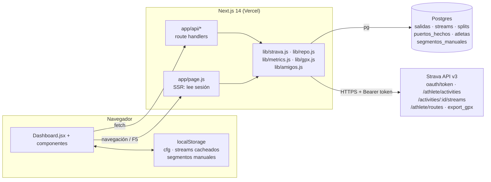
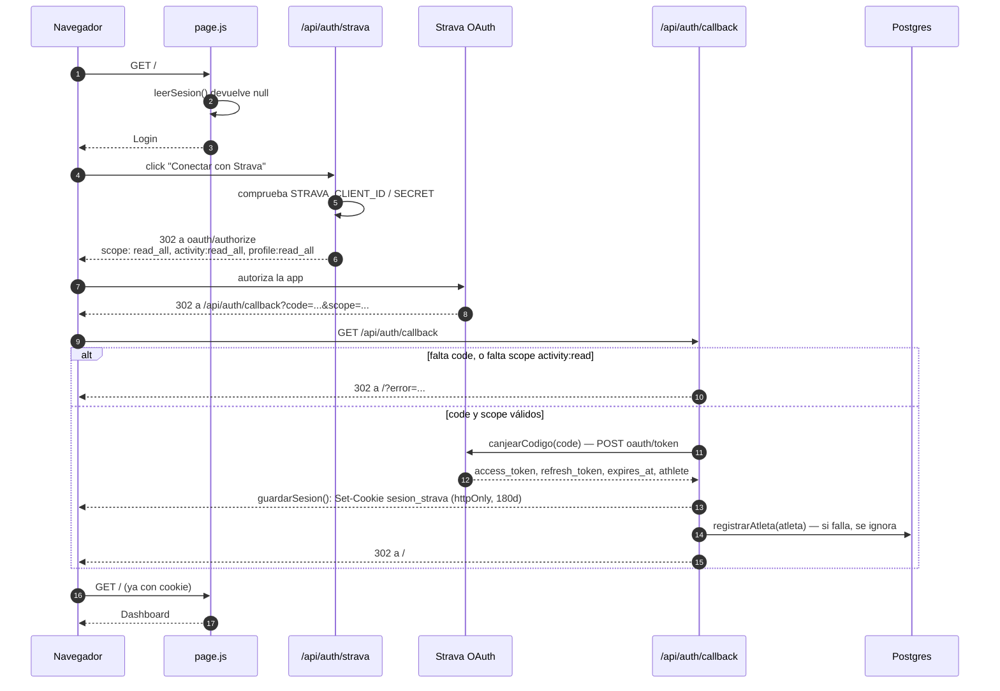
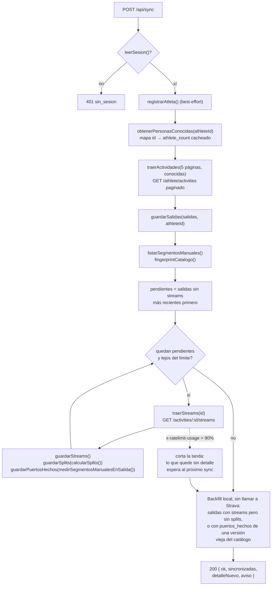
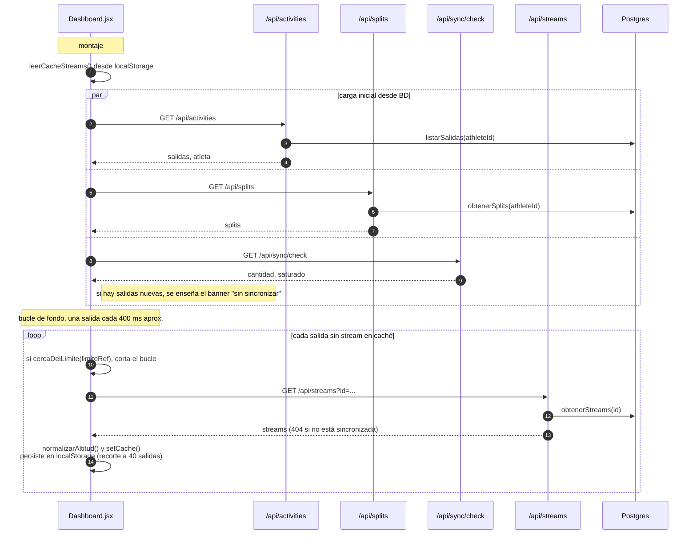
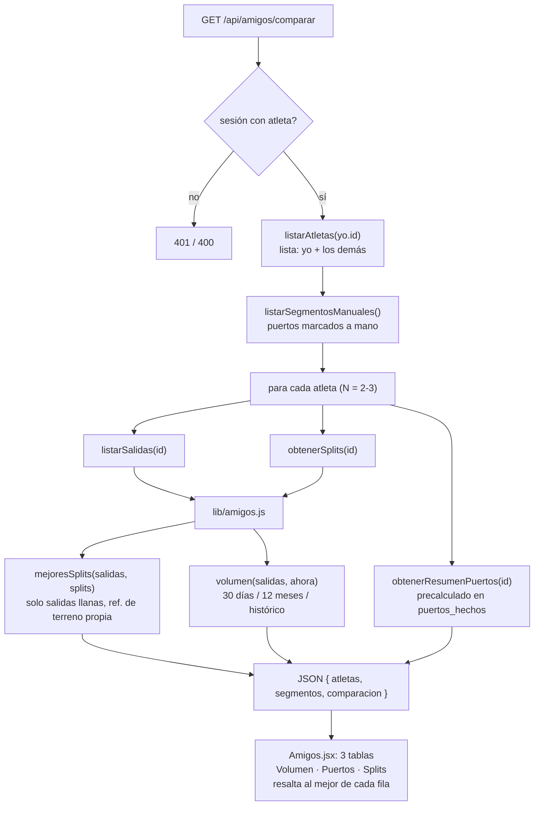
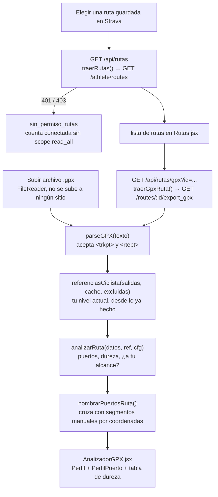

# Flujos principales

Diagramas de los recorridos de datos más importantes del panel. Se renderizan
solos en GitHub y en VS Code. Si cambias un flujo, actualiza aquí el diagrama
correspondiente.

Índice:

1. [Arquitectura general](#1-arquitectura-general)
2. [Autenticación con Strava (OAuth)](#2-autenticación-con-strava-oauth)
3. [Sincronización (`POST /api/sync`)](#3-sincronización-post-apisync)
4. [Carga del Dashboard y streams en segundo plano](#4-carga-del-dashboard-y-streams-en-segundo-plano)
5. [Comparación de Amigos](#5-comparación-de-amigos)
6. [Analizador de GPX](#6-analizador-de-gpx)

---

## 1. Arquitectura general

Next.js 14 (App Router) hace de todo: sirve la UI y expone las rutas de API que
hablan con Strava y con Postgres. El navegador nunca llama a Strava directamente
—siempre pasa por el servidor, que es quien tiene el token.

**Claves**

- La identidad del ciclista y los tokens viven en una **cookie httpOnly**
  (`sesion_strava`, base64), no en la base de datos. La tabla `atletas` solo
  guarda id + nombre, y se rellena en el login y en cada sync para que la
  pestaña Amigos pueda listar a todo el mundo.
- Los cálculos pesados (`lib/metrics.js`, `lib/gpx.js`, `lib/amigos.js`) son
  funciones puras sin red ni navegador, para poder probarlos con `node --test`.

---

## 2. Autenticación con Strava (OAuth)

Sin cookie de sesión válida, `app/page.js` pinta `Login`. El resto es el
_authorization code flow_ estándar de Strava.

**Refresco de token** — no hay ruta dedicada. Cualquier llamada a Strava pasa
por `tokenValido()` en `lib/strava.js`: si al `access_token` le quedan menos de
120 s, lo refresca contra `oauth/token` y reescribe la cookie antes de seguir.

**Logout** — `POST /api/auth/logout` solo borra la cookie.

---

## 3. Sincronización (`POST /api/sync`)

Se dispara a mano desde el botón "Actualizar" o desde el banner de "salidas sin
sincronizar". Es la operación cara: la única que descarga datos nuevos de
Strava, y va vigilando el límite de la API para no provocar un 429.

**Por qué en este orden**

- Los streams solo se piden de lo que aún no los tiene: son inmutables una vez
  terminada la salida, releerlos era el gasto que agotó la cuota de la API.
- Se procesan de la más reciente a la más antigua: si Strava corta a mitad, lo
  que se queda sin sincronizar es lo viejo, no lo que el usuario acaba de subir.
- El backfill recalcula `splits` y `puertos_hechos` que quedaron obsoletos
  (cálculo nuevo, o segmento manual creado/editado). Es todo Postgres, no
  compite por el límite de Strava.

**Comprobación ligera** — `GET /api/sync/check` es otra cosa: una sola petición
a Strava con los ids de las ~11 últimas actividades, para decidir si enseñar el
banner. No sincroniza nada.

---

## 4. Carga del Dashboard y streams en segundo plano

Al montar, el Dashboard lee de **Postgres** (rápido, sin tocar Strava) y luego
va rellenando en segundo plano el detalle de cada salida, con caché en
`localStorage` para que un F5 no vuelva a pedirlo todo.

**Notas**

- El bucle de fondo llama a `/api/streams`, que **solo lee Postgres**: si una
  salida no está sincronizada devuelve 404 y esa salida se queda sin perfil
  hasta el próximo `/api/sync`.
- El `limite` de Strava que se usa para frenar aquí viaja en el cuerpo de las
  respuestas de `/api/streams` incluso cuando son error.
- Abrir una salida a mano en Actividades la pide al instante; el bucle mira la
  caché antes de cada petición para no pedirla dos veces.

---

## 5. Comparación de Amigos

`GET /api/amigos/comparar` compara a quien mira contra todos los ciclistas que
han conectado su Strava en el mismo panel. Todo se agrega en el servidor: nunca
se devuelven streams de nadie.

**Notas**

- Son N+1 consultas (una tanda por persona), pero N es el número de gente que ha
  conectado: 2-3. No se pagina.
- Los tiempos de puerto salen ya calculados de `puertos_hechos` (la llena
  `/api/sync`), no se recalculan sobre streams aquí.
- Con menos de 2 atletas la pestaña solo muestra el aviso de "cuando otro
  ciclista conecte su Strava…".

---

## 6. Analizador de GPX

Dos formas de meter una ruta, un solo analizador. El análisis (`analizarRuta`,
`lib/gpx.js`) corre **entero en el navegador**.

**Notas**

- El archivo subido se lee con `FileReader` en el cliente; no hay ruta de API
  para subirlo.
- La ruta de Strava sí pasa por el servidor (necesita el token), pero solo para
  traer el GPX: se reutiliza el mismo `parseGPX` que los archivos locales.
- Los nombres de las subidas salen del catálogo de segmentos marcados a mano; lo
  que no está marcado queda como "Subida N".
